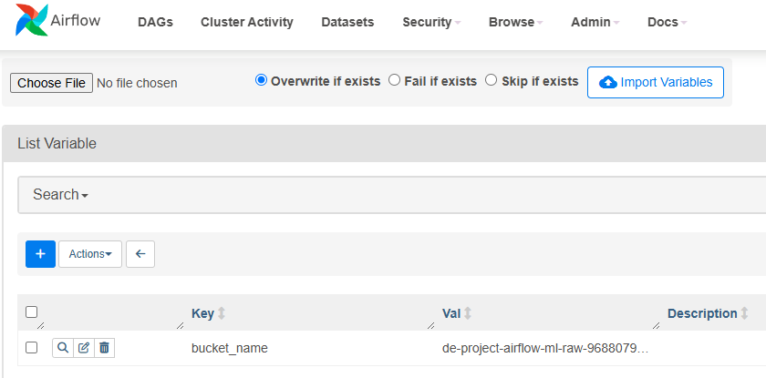

## Building an Advanced Data Pipeline With Data Quality Checks

This report documents the development of an advanced data pipeline using Apache Airflow. 
The project aims to establish a robust framework that incorporates data quality checks, dynamic DAGs, and machine learning model training and evaluation. 
The pipeline leverages tools like Great Expectations and the TaskFlow API to ensure efficient and scalable workflows.

### 1. The DAG Details

#### Overview of Tasks:
Descriptions of the tasks that constitute the DAG:
- `start`: an empty task marking the start of the DAG. It doesn't include any behavior.
- `data_quality`: triggers a data quality check on the data using the `@task.virtualenv` decorator from the TaskFlow API.
- `train_and_evaluate`: trains and evaluates a model to estimate ride duration and returns the performance metric.
- `is_deployable`: decides whether to deploy a model based on the model performance.
- `deploy`: prints a deployment message to simulate the deployment process of the model.
- `notify`: prints a notification message to simulate the notification for a low-performance model.
- `end`: an empty task marking the end of the DAG. It doesn't include any behavior and will be executed with the `DummyOperator`.

---

### 2. Setting Up Airflow's Components

This section details the essential steps to prepare the environment for running Apache Airflow. 
The setup includes launching an EC2 instance, creating S3 buckets, and configuring the Apache Airflow Web Server.

#### EC2 instance

EC2 instance was launched using the AWS Management Console with the following steps:

**1. Navigate to the AWS Management Console EC2 service and choose Launch Instance**

   

**2. Configuration of the instance**
   
  - **Name**: Enter instance name `de-project-airflow-ml-pipeline-968807950973`
    
  - **AMI**: Amazon Linux AMI
    
  - **Instance Type**: Choose t2.medium which is suitable for small-scale workflows with lightweight DAGs and minimal concurrent tasks for this project.
    
   
    
  - **Key Pair**: Create a key pair for SSH access and save the `.pem` file securely in the project folder.
    
   

  - **IAM instance profile**: Attach the IAM role which gives access to the S3 buckets.

   
    
**3. Configure security groups**

  - Click on the identifier under **Security groups** in the **Security** tab of the EC2 instance.

   
     
  - Select **Edit inbound rules** and add rules to allow inbound traffic for port 8080, enabling access to the Apache Airflow Web Server interface.
  
   

#### Apache Airflow Web Server

Next, Apache Airflow was installed and configured on the EC2 instance to manage the data pipelines. 
The following steps were performed:

**1. SSH into the EC2 instance**

```bash
ssh -i <key-pair.pem> ec2-user@<public-ip-address>
```

**2. Install and configure all necessary dependencies, Apache Airflow, and Great Expectations on EC2 instance**

```bash
sudo yum update -y
sudo yum install python3-pip -y

pip install apache-airflow
pip install great_expectations

# Install Airflow Provider for Great Expectations
pip install airflow-provider-great-expectations==0.1.1
```

**3. Initialize and Configure Apache Airflow**

```bash
# Initialize and start the Airflow webserver on port 8080
airflow db init
airflow webserver -p 8080

# Create an admin user for Airflow
airflow users create -u admin -p admin -r Admin -e admin@example.com -f Admin -l User
```

**4. Access the Airflow Web Server via the public IP address**
   
  - Copy and paste the `Public IPv4 DNS` into a broswer tab and add :8080 at the end to access the Airflow UI.
  - Login with username and password.

   

#### Create S3 Buckets

Finally, S3 buckets were created to store and manage data files and DAGs required by Apache Airflow. 
The setup process involved:

**1. Navigate to the **S3** service and click Create Bucket**
   
  - A **Raw Data Bucket** `de-project-airflow-ml-raw-968807950973` to store input files for data processing pipelines.
  - A **DAGs Bucket** `de-project-airflow-ml-dags-968807950973` to host DAG scripts for Airflow.

  

**2. Configure bucket permissions**

  - The following bucket policy was used to allow the EC2 instance access to the bucket:
  
   ```bash
   {
       "Version": "2012-10-17",
       "Statement": [
           {
               "Effect": "Allow",
               "Principal": {
                   "AWS": "arn:aws:iam::968807950973:role/EC2-S3-access-role"
               },
               "Action": "s3:*",
               "Resource": "arn:aws:s3:::de-project-airflow-ml-dags-968807950973/*"
           }
       ]
   }
   ```
---

### 3. Preprocessing the Data

The data was preprocessed and divided into train and test sets, partitioned by vendor name. 
The `data` folder structure is organized as follows:

Structure of the data folder
- `"work_zone/data_science_project/datasets/<VENDOR_NAME>/train.parquet"`
- `"work_zone/data_science_project/datasets/<VENDOR_NAME>/train.parquet"`

Where `<VENDOR_NAME>` includes:
- `easy_destiny`
- `alitran`
- `to_my_place_ai`

#### Synchronizing Data with *Raw Data Bucket*

To store the data in the Raw Data Bucket, the following commands were executed:

```bash
cd data
aws s3 sync work_zone s3://de-project-airflow-ml-raw-968807950973/work_zone/
cd ..
```

Next steps include designing a pipeline to validate the quality of this data and building custom models for each vendor based on specific requirements.

---

### 4. Creating the DAG and Its Tasks

#### Checking Data Quality

Data quality checks ensure the suitability of the data for its intended purpose. 
Validation of the `passenger_count` column was performed using **Great Expectations** (GX) to meet the business rule that no trip can have more than 6 passengers. 
Models were only trained if this criterion was satisfied.

To implement this, the expectation suite JSON file (de-expectation-suite.json) was created with the following content:

```JSON
{
  "expectation_suite_name": "de-expectation-suite",
  "expectations": [
    {
      "expectation_type": "expect_column_values_to_be_between",
      "kwargs": {
        "column": "passenger_count", 
        "min_value": 1, 
        "max_value": 6, 
        "mostly": 1.0
      }
    }
  ]
}
```

This expectation suite was integrated into the DAG using the `GreatExpectationsOperator`, ensuring that data quality checks were rigorously applied before proceeding to downstream tasks. 
The validation guarantees that models are only trained on data that adheres to the defined business rules.

The GreatExpectationsOperator was configured within the DAG script for `easy_destiny` as shown below:

```python

data_quality_task = GreatExpectationsOperator(
    task_id="data_quality", 
    data_context_root_dir="./dags/gx",

    # Specifies the name of the data asset to validate.
    data_asset_name="train_easy_destiny",

    # Reads the Parquet file from the S3 bucket for the vendor "easy_destiny".
    dataframe_to_validate=pd.read_parquet(
        f"s3://{Variable.get('bucket_name')}/work_zone/data_science_project/datasets/"
        f"{vendor_name}/train.parquet"
    ),

    # Configures the execution engine to use Pandas for validation.
    execution_engine="PandasExecutionEngine",

    # Sets the name of the expectation suite to use for validation.
    expectation_suite_name=f"de-expectation-suite",

    # Enables the return of a JSON-serializable dictionary for validation results.
    return_json_dict=True,

    # Ensures that the task fails if the validation does not pass.
    fail_task_on_validation_failure=True,
)
```

This operator ensures that the validation checks are performed efficiently and integrates seamlessly into the Airflow DAG. 
If the validation fails, the pipeline stops, preventing the training of models on invalid data.

Next, a variable for `bucket_name` was created from the Airflow UI.
This variable allows the DAG to dynamically reference the raw data bucket without hardcoding its name.



#### Training and Evaluating the ML Model

The pipeline includes a task to train a **linear regression model** for predicting trip duration, followed by performance evaluation using **Root-Mean-Square Error (RMSE)**. 
The TaskFlow API was used to configure this task, ensuring the performance metric was returned for subsequent tasks.

The `train_and_evaluate()` function, configured within the DAG script for `easy_destiny`, is implemented as follows:

```python

def train_and_evaluate(bucket_name: str, vendor_name: str):
  
    # Define the path to the datasets stored in the S3 bucket.
    datasets_path = (
        f"s3://{bucket_name}/work_zone/data_science_project/datasets"
    )

    # Load the train and test datasets from S3 using the vendor name.
    train = pd.read_parquet(f"{datasets_path}/{vendor_name}/train.parquet") 
    test = pd.read_parquet(f"{datasets_path}/{vendor_name}/test.parquet")  

    # Extract input features and output targets for train and test splits.
    X_train = train[["distance"]].to_numpy()[:, 0] 
    X_test = test[["distance"]].to_numpy()[:, 0]  

    y_train = train[["trip_duration"]].to_numpy()[:, 0] 
    y_test = test[["trip_duration"]].to_numpy()[:, 0]  

    # Train a linear regression model using the training data.
    model = linregress(X_train, y_train)

    # Evaluate the model's performance using RMSE on the test data.
    y_pred_test = model.slope * X_test + model.intercept 
    performance = np.sqrt(np.average((y_pred_test - y_test) ** 2)) 
    print("--- performance RMSE ---")
    print(f"test: {performance:.2f}") 

    return performance
```

**Key Highlights:**
- **Data Loading**: The function reads both train and test datasets directly from the S3 bucket using the `pd.read_parquet()` method.
- **Feature Preparation**: Inputs (`distance`) and outputs (`trip_duration`) are extracted from the datasets for model training and evaluation.
- **Model Training**: A linear regression model is trained using the `linregress()` function.
- **Evaluation Metric**: The Root-Mean-Square Error (RMSE) is computed to assess the model’s prediction accuracy.

This function ensures a streamlined process for training and evaluating the model, with its performance metric used to guide decisions in downstream tasks such as deployment and notification.

#### Branching the ML Model

In this step, conditional task execution is implemented to decide whether to deploy the model or notify that it is not deployable based on its performance. 
The branching logic ensures that only models meeting the performance criteria proceed to deployment, while others trigger a notification task.

The `_is_deployable()` function and the corresponding `BranchPythonOperator` are configured as follows:

```python

def _is_deployable(ti):

    # Retrieve the performance metric from the `train_and_evaluate` task
    performance = ti.xcom_pull(task_ids="train_and_evaluate")

    # Check if the performance is below the threshold of 500
    if performance < 500:
        print(f"is deployable: {performance}")
        return "deploy"
    else:
        print("is not deployable")
        return "notify"

# Define the `BranchPythonOperator` to implement branching logic
is_deployable_task = BranchPythonOperator(
    task_id="is_deployable",
    python_callable=_is_deployable,
    do_xcom_push=False,
)

# Define the deploy task
@task
def deploy():
    print("Deploying...")

# Define the notify task with a message parameter
@task
def notify(message):
    print(f"{message}. " "Notify to mail: admin@easy_destiny.com") 
```

**Key Highlights:**
- **Branching Logic**: The `_is_deployable()` function determines the next task (`deploy` or `notify`) based on the performance metric retrieved via `XCom`.
- **Performance Threshold**: Models with RMSE below 500 are considered deployable, while others trigger a notification process.
- **BranchPythonOperator**: This operator integrates branching functionality into the DAG by invoking the `_is_deployable()` function.

This branching mechanism ensures the pipeline’s flexibility and responsiveness, directing tasks conditionally based on the evaluation of the model’s performance.

#### Defining the DAG Dependencies

Task dependencies within the DAG are defined using the `>>` operator to specify the order of execution. 
This ensures that tasks are executed in a sequential and logical manner, creating a clear execution flow.

Below is the definition of DAG dependencies for `easy_destiny`:

```python

(
    start_task
    >> data_quality_task
    >> train_and_evaluate(
        bucket_name="{{ var.value.bucket_name }}",
        vendor_name="easy_destiny",
    )
    >> is_deployable_task
    >> [deploy(), notify("Not deployed")]
    >> end_task
)
```

The `start_task` acts as the entry point of the DAG without performing any operations.
This is followed by the `data_quality_task` which performs data quality checks to ensure that the input data meets predefined criteria.
Once the data is validated, the `train_and_evaluate` task trains a regression model and evaluates its performance using RMSE.
Next, the `is_deployable_task` task evaluates the performance of the model and directs the workflow to either the `deploy()` or `notify()` task.
If the model's performance satisfies the condition, the `deploy()` task will execute the deployment process.
Otherwise, the workflow will be directed to the `notify()` task which will send a notification, signaling that deployment is not possible.
Lastly. the `end_task` task marks the conclusion of the workflow, ensuring the DAG completes successfully regardless of the branch taken.

**Key Highlights:**
- **Sequential Flow**: Tasks are connected using the `>>` operator to ensure orderly execution.
- **Branching Logic**: The `is_deployable_task` determines whether the pipeline flows to the `deploy()` task or the `notify()` task.
- **Reusability**: The `train_and_evaluate()` function is parameterized to accept vendor-specific inputs, enhancing flexibility.

This setup clearly defines the execution order and conditional pathways, ensuring the DAG performs as intended for the pipeline.

---

### 5. Dynamic DAGs

#### Avoiding Code Duplication

To support additional vendors, **To My Place AI** and **Alitran**, dynamic DAG generation was implemented to avoid repeating similar code. 
The DAG previously developed for **Easy Destiny** served as a foundation for creating a reusable template using the **Jinja** templating engine. 
This approach allowed for efficient adaptation of the DAG to multiple vendors with minimal modifications.

#### Creating the Template File

Copy the contents of the existing `src/model_trip_duration_easy_destiny.py` file into a new file named `src/templates/template.py`.
In the `template.py` file, all occurrences of the DAG name `model_trip_duration_easy_destiny` were replaced with the Jinja template `{{ dag_name }}`.
Similarly, all occurrences of the vendor name `easy_destiny` were replaced with the Jinja template `{{ vendor_name }}`.

By leveraging the Jinja templating engine, the DAG template retained all functionality while allowing the DAG name and vendor name to be parameterized. 
This solution streamlined the creation of pipelines for To My Place AI and Alitran, ensuring consistency and reducing redundancy across the DAGs.

#### Creating the Configuration Files

To generate DAGs dynamically using the created template, configuration files were prepared to provide vendor-specific values. 
Each configuration file represents the variables required for a single DAG, defined as key-value pairs corresponding to the template variables.

For the three vendors—`easy_destiny`, `alitran`, and `to_my_place_ai`—separate configuration files were created in the folder `src/templates/dag_configs`. These files were named:

- `config_easy_destiny.json`
- `config_alitran.json`
- `config_to_my_place_ai.json`

Exmaple of the configuration file for easy_destiny:

```JSON
{
"dag_name": "model_trip_duration_easy_destiny",
"vendor_name": "easy_destiny"
}
```

- Similar configurations were created for `alitran` and `to_my_place_ai`.

#### Generating the DAGs

With the template and configuration files prepared, the next step involved generating the dynamic DAGs. 
The generation of DAG files is automated using the script `generate_dags.py`. 
This script iterates over the configuration files and combines them with the Jinja template to produce vendor-specific DAGs.

The `main()` function orchestrates the DAG generation process by reading the template file, iterating through configuration files, and rendering the DAGs. 
Below is the implementation:

```python

def main():

    with open("./template.py", "r", encoding="utf-8") as file:
        unsafe_template_str = file.read()

    # Define the folder containing configuration files
    folder_configs = Path("./dag_configs/")
    print(f"folder_configs {folder_configs}")
    
    # Define the directory for the generated DAG files
    dags_dir = "./../dags"
    
    # Iterate over all JSON files matching the pattern "config_*.json"
    for path_config in folder_configs.glob("config_*.json"):
        with open(path_config, "r", encoding="utf-8") as file:
            config = json.load(file)

        # Protect undefined Jinja expressions in the template file
        template_str = protect_undefineds(unsafe_template_str, config)
        
        # Define the output filename for the generated DAG
        filename = f"{dags_dir}/{config['dag_name']}.py"

        content = Template(template_str).render(config)
        
        with open(filename, mode="w", encoding="utf-8") as file:
            file.write(content)
            print(f"Created {filename} from config: {path_config.name}...")
```

**Key Highlights:**
- **Template Loading**: Reads the template file and stores it as a string.
- **Iterative Processing**: Processes each JSON configuration file to render the final DAG content.

With the `generate_dags.py` script defined, the following command was used to generate the DAGs dynamically.

```bash
cd src/templates
python3 ./generate_dags.py
```

As a result, three DAG files were generated in the `src/dags/` folder, one for each vendor


---

### 6. Running the DAGs with Airflow

To deploy the dynamically generated DAGs

- The src/dags folder was synchronized with the DAGs Bucket.

 ```bash
 cd ../..
 aws s3 sync src/dags s3://de-project-airflow-ml-dags-968807950973/dags
 ```

- Next, the DAGs Bucket was synchronized with the `dags_folder` of the instance.

 ```bash
 cd ../..
 aws s3 sync s3://de-project-airflow-ml-dags-968807950973/dags /home/ec2-user/airflow/dags
 ```
   
After the DAGs were copied to the `dags_folder`, all three DAGs will be listed in the Airflow UI. Toggle the DAGs to executed it. 


The results were as follows:

<div style="display: flex; justify-content: space-around;">
   
   
   
</div>

- **model_trip_duration_alitran**: This DAG notified that the model was not deployed due to unsatisfactory performance.
- **model_trip_duration_easy_destiny**: Successfully deployed the model as it met the performance criteria.
- **model_trip_duration_to_my_place_ai**: Failed the data quality checkpoint established by Great Expectations, resulting in the DAG terminating successfully with validation failure.

> Note: Run the DAGs sequentially to ensure smooth execution.
> This minimizes potential retries in the Great Expectations task, which requires access to documentation files and can experience conflicts when multiple DAGs attempt to access them concurrently.

The DAG **model_trip_duration_to_my_place_ai** was anticipated to "fail successfully," as the data did not meet the validation requirements during the quality check process. 
This design demonstrated the robustness of the pipeline in handling invalid data appropriately.

---

### Reflections and Improvements

This project demonstrates the successful integration of data quality checks, dynamic DAG generation, and ML model training in Apache Airflow. 
Future improvements could include:

- Exploring advanced data validation techniques.
- Optimizing pipeline performance for larger datasets.
- Integrating more complex branching logic for additional workflows.

The project establishes a strong foundation for building scalable and efficient data pipelines while adhering to industry best practices.


